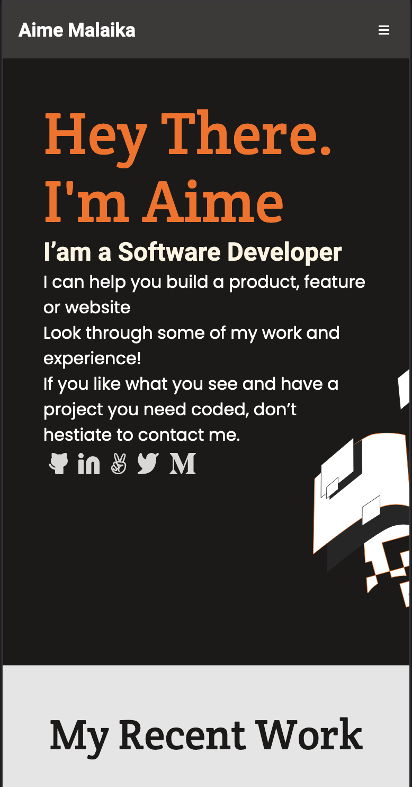

# My Portofolio
> this porject is my portofolio an ultimate way to showcase your work and let others reach out for me.\
\
> It presents my professionalism and dedication to the craft better and more clearly than any CV.\

## Built With

- HTML & CSS
- Html & Css linters

## Live Demo

### [LIVE DEMO LINK](https://aimemalaika.github.io/cr-training-contact-form/)

## Getting Started
- clone the repository by running\
    `git clone https://github.com/aimemalaika/cr-training-contact-form.git`
- navigate to the folder\
    `cd cr-training-contact-form`

## Authors

👤 **Aime Malaika**

- GitHub: [@aimemalaika](https://github.com/aimemalaika)
- Twitter: [@Aime_malaika](https://twitter.com/Aime_Malaika)
- LinkedIn: [aimemalaika](https://linkedin.com/in/aimemalaika)

## 🤝 Contributing

Contributions, issues, and feature requests are welcome!

## Show your support

Give a ⭐️ if you like this project!

## Acknowledgments

- Hat tip to anyone whose code was used
- Inspiration
- etc

## 📝 License

This project is [MIT](./MIT.md) licensed.
